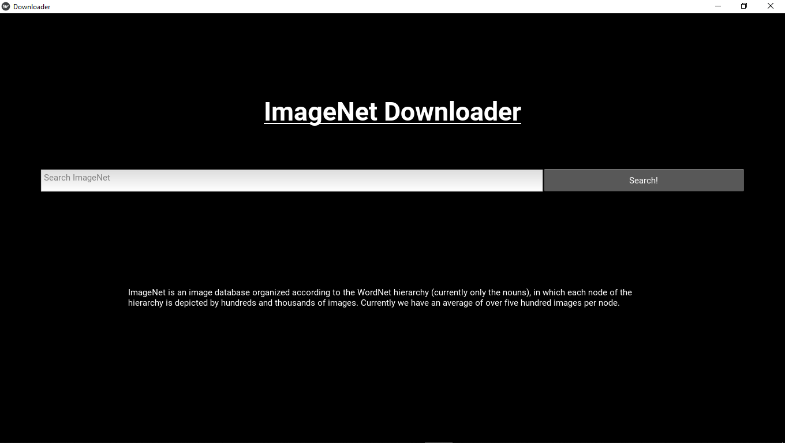
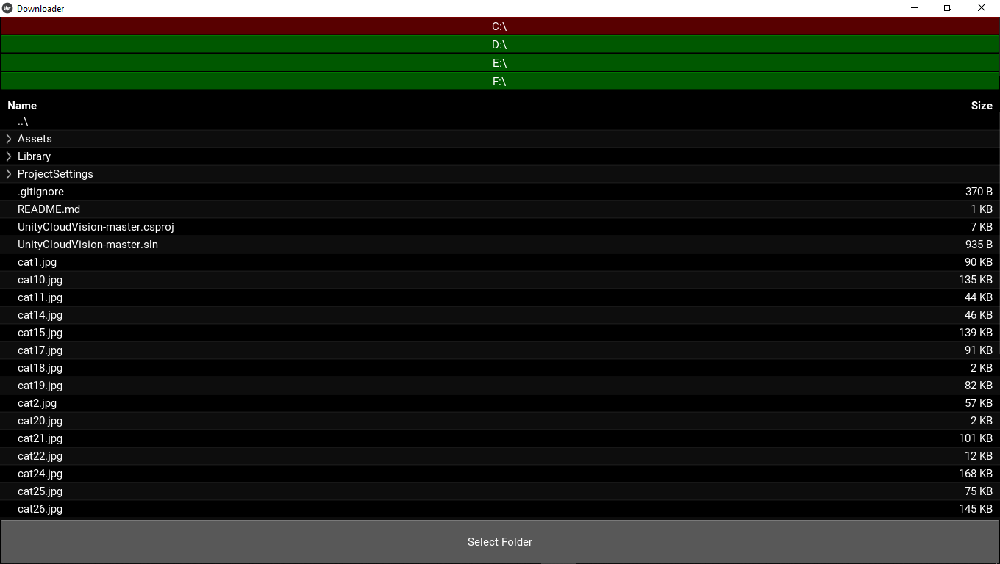
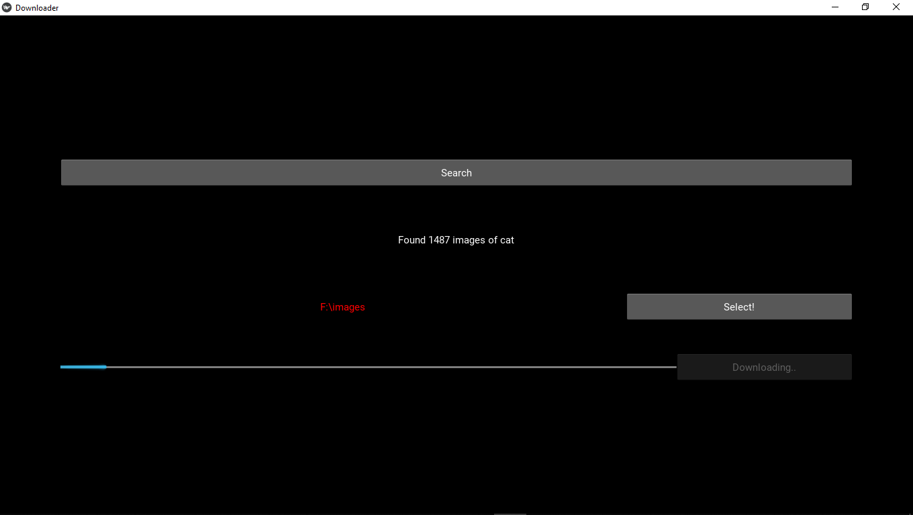

# ImageNet-Downloader
A python GUI based webscrapper to download images from http://image-net.org/ (ImageNet)   
Search the name of category of the image and then proceed to download all the images available from that catgory.  
<u>Libraries used:<u/>  
Kivy (GUI) 
Nltk.wordnet (for Synset Id of image category name)  
beautifulsoup (web scrapping)  
urllib (downloading images) 

## Screen Shots of the application :

